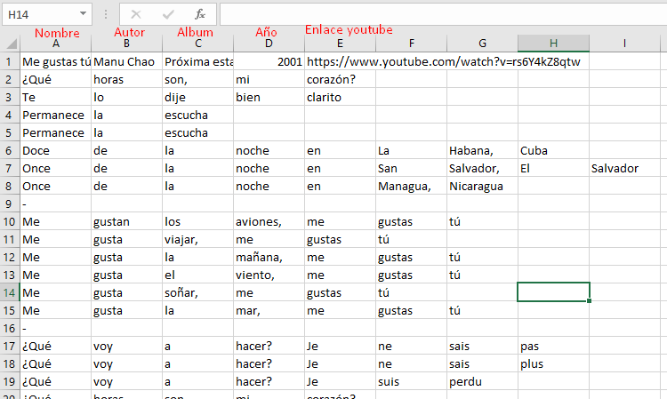

# 🎵💃 Midi, Ascii Party Rebelde 🕺🎵

## Tener en cuenta:

- Proyecto en parejas
- Se debe crear un repositorio por equipo
- Se debe subir varios commits y push dependiendo de la estrategía de solución del proyecto
- Se debe interactuar con un archivo, el cual será construído entre todos los estudiantes
- El proyecto se realizará avanzando cada semana, por tanto debe estar pendiente de este repositorio
- Cada equipo plantea un proyecto que use la lista de canciones y los audios de las mismas

## Criterios de evaluación:

- (10%) Trabajo en el repositorio, mínimo 15 commits* por cada estudiantes para terminar el proyecto
- (10%) Realizar un video de la aplicación funcionando y publicar en youtube
- (10%) Subir el diseño de la letra correspondiente en este repositorio como pull request
- (10%) Configuración y programación menú
- (25%) Programación de la aplicación y personalización de la interfaz gráfica
- (20%) Exposición entrega final ejercicio (Diapositivas y presentación)
- (5%) Buenas prácticas en el código
- (10%) Aplicación del concepto de funciones en el proyecto

:new: * No son validos los commits de seguimiento

## Instrucciones de cada canción

1. Cada grupo debe buscar una canción de rock en español en formato midi y subirlo como pull request a la carpeta (/canciones) de este repositorio

2. Luego se debe buscar la letra de la canción, y guardarla en el archivo /recursos/letras.csv, es es un archivo separado por punto y coma, cada frase debe ocupar una línea del achivo y cada palabra debe ocupar una celda.

3. Al principio de los datos de cada canción se debe poner, el nombre de la canción, el autor, el albúm, el año y por último el enlace de youtube.

4. Puede ver un ejemplo en la siguiente imagen.

 

5. En cada programa se debe leer la letra de la canción y los nombres de los archivos de audio.

6. Se debe poder buscar en la lista de canciones, por medio del autor, palabras claves de la canción, el año, etc. Esto puede ser una funcionalida explicita del programa o puede ser parte de la programación de uno de los métodos de la lógica de la aplicación.

7. Se debe poder imprimir la lista de todas las canciones usadas, o por lo menos cargarlas en memoria.

## Helpers

Son programas de java, con funciones listas, que el estudiante podrá usar como ayuda para realizar operaciones en el proyecto.

- Audio: reproduce archivos de audio en formato midi
- ConsoleColors: Contiene la información de los colores
- ConsoleFile: Realiza operaciones con archivos
- ConsoleInput: Permite leer datos que el usuario ingrese
- ConsoleData: Procesa un conjunto de datos
- :new: ConsoleAnimator: Base para realizar animacion en consola, sin terminar
- :new: RandomHelper: Calcula numeros aleatorios entre numeros enteres menor, mayor, incluyendo ambos valores.
- :new: AsciiEjemplo: Ejemplo para imprimir menú personalizado

## Referentes

- [Guia de markdown](https://github.com/adam-p/markdown-here/wiki/Markdown-Cheatsheet)
- [Unicode table](https://unicode-table.com/en/)
- [Bitmidi](https://bitmidi.com/)
- [Música midi gratis](http://www.musicamidigratis.com/)
- [Midi world](https://www.midiworld.com/)
- [Video game music archive](http://www.vgmusic.com/)
- [Me gustas tu - Manu Chao](https://genius.com/Manu-chao-me-gustas-tu-lyrics)
- [Ejemplo datos en matriz](https://onlinegdb.com/r14vUiWvu)
- [StringBuilder](https://docs.oracle.com/javase/7/docs/api/java/lang/StringBuilder.html#replace(int,%20int,%20java.lang.String))
- [Tabla de caracteres Unicode](https://unicode-table.com/es/)
- [Tabla de caracteres latinos](https://ingmmurillo.blogspot.com/2012/05/tabla-de-caracteres-latinos-en-unicode.html)
- [Lectura de archivos grandes usando Stream](https://mkyong.com/java8/java-8-stream-read-a-file-line-by-line/)
- [Interfaz Stream](https://docs.oracle.com/javase/8/docs/api/java/util/stream/package-summary.html)
- [Ejemplos Stream](https://stackabuse.com/guide-to-java-streams-foreach-with-examples/)
- [Números aleatrios](https://memorynotfound.com/random-number-inclusive-exclusive-java/)

## Inspiración

- [Spotify - View lyrics](https://support.spotify.com/us/article/view-lyrics/)
